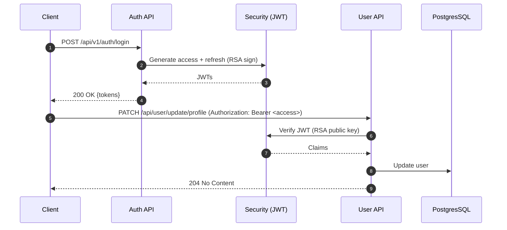

# Project Asymmetric Keys

[](https://adoptium.net/)
[](https://spring.io/projects/spring-boot)
[](https://maven.apache.org/)
[](http://localhost:8080/swagger-ui/index.html)
[](./LICENSE)

A secure Spring Boot application demonstrating JWT authentication using asymmetric RSA keys, with user profile management and role-based access control. It includes disposable email detection, validation-rich DTOs, OpenAPI documentation, and a ready-to-run local Postgres setup via Docker Compose.

---

## Features

- 🔐 JWT authentication signed with RSA private key, verified with a public key
- 👥 User flows: register, login, refresh token, update profile, change password, deactivate/reactivate
- 🛡️ Role-Based Access Control (RBAC) via Spring Security
- 📧 Email validation plus disposable-domain blocking
- 📚 Interactive API docs with Swagger UI (springdoc-openapi)
- 🗄️ PostgreSQL integration with Docker Compose
- 🧰 Production-grade defaults: exception handling, actuator, logging (Logback)

## Technology Stack

- Language/Runtime: Java (configured for `25` in `pom.xml`)
- Frameworks: Spring Boot 3.5.x, Spring Web, Spring Security, Spring Data JPA
- Auth/JWT: JJWT (sign/verify with RSA keypair)
- Docs: springdoc-openapi-starter-webmvc-ui
- DB: PostgreSQL
- Build: Maven
- Mapping/Boilerplate: MapStruct, Lombok

## Prerequisites

- Java 21+ (project configured for Java 25 in `pom.xml`)
- Maven 3.8+
- Docker Desktop (for local Postgres via Compose)
- OpenSSL (to generate RSA keypair)

Optional:
- curl or HTTP client (Postman/Insomnia)

## System Requirements

- CPU/RAM: any modern dev machine (≥2 cores, ≥4 GB RAM)
- Disk: ~1 GB free (dependencies + Docker volume)

---

## Quickstart (Local Development)

1) Clone
```bash
git clone <your-repository-url>
cd project-asymmetric-keys
```

2) Start PostgresSQL with Docker Compose
```bash
# In project root
docker compose up -d
```
- Postgres image: `postgres:17.6`
- Port: `5432`
- Default DB: `spring_security_3`
- User/Password: `postgres` / `version`

3) Create `.env` in project root
The application reads environment variables from `.env` (see `spring.config.import` in `application.yaml`).
```env
# Database
db_url=localhost
db_port=5432
db_name=spring_security_3
db_username=postgres
db_password=version

# Timezone for JDBC
db_timezone=Asia/Kolkata
```

4) Generate RSA keys (required for JWT)
The service loads keys from classpath `keys/local-only/private_key.pem` and `keys/local-only/public_key.pem` (see `JwtServices`).

- Create the directory
  - macOS/Linux (bash):
    ```bash
    mkdir -p src/main/resources/keys/local-only
    ```
  - Windows (PowerShell):
    ```powershell
    New-Item -ItemType Directory -Force -Path src/main/resources/keys/local-only | Out-Null
    ```

- Generate a 4096-bit RSA keypair with OpenSSL (produces PKCS#8 private and X.509 public keys expected by `KeyUtils`)
  - macOS/Linux:
    ```bash
    openssl genpkey -algorithm RSA -out src/main/resources/keys/local-only/private_key.pem -pkeyopt rsa_keygen_bits:4096
    openssl rsa -pubout -in src/main/resources/keys/local-only/private_key.pem -out src/main/resources/keys/local-only/public_key.pem
    ```
  - Windows (PowerShell, OpenSSL installed):
    ```powershell
    openssl genpkey -algorithm RSA -out src/main/resources/keys/local-only/private_key.pem -pkeyopt rsa_keygen_bits:4096
    openssl rsa -pubout -in src/main/resources/keys/local-only/private_key.pem -out src/main/resources/keys/local-only/public_key.pem
    ```

5) Run the application
```bash
mvn spring-boot:run
```

6) Open API docs
- Swagger UI: http://localhost:8080/swagger-ui/index.html
- Alternate: http://localhost:8080/swagger-ui.html

---

## Usage

### Base URL
- Local: `http://localhost:8080`

### Authentication API
Base path: `/api/v1/auth`

- Register
  - Endpoint: `POST /api/v1/auth/register`
  - Returns: `201 Created` (no body)
  - Example:
    ```bash
    curl -X POST http://localhost:8080/api/v1/auth/register \
      -H "Content-Type: application/json" \
      -d '{
            "firstName": "John",
            "lastName": "Doe",
            "email": "user001@mail.com",
            "phoneNumber": "+9199034292592",
            "password": "pAssword1!_",
            "confirmPassword": "pAssword1!_"
          }'
    ```

- Login
  - Endpoint: `POST /api/v1/auth/login`
  - Returns: `200 OK` with tokens
  - Response body (`AuthenticationResponse`):
    ```json
    {
      "access_token": "<JWT>",
      "refresh_token": "<JWT>",
      "token_type": "Bearer"
    }
    ```

- Refresh Access Token
  - Endpoint: `POST /api/v1/auth/refresh/token`
  - Body:
    ```json
    { "refreshToken": "<REFRESH_JWT>" }
    ```

### User API
Base path: `/api/user` (requires `Authorization: Bearer <ACCESS_TOKEN>`)

- Update profile
  - `PATCH /api/user/update/profile`
  - Example:
    ```bash
    curl -X PATCH http://localhost:8080/api/user/update/profile \
      -H "Authorization: Bearer <ACCESS_TOKEN>" \
      -H "Content-Type: application/json" \
      -d '{
            "firstName": "Jane",
            "lastName": "Doe",
            "phoneNumber": "+1234567890"
          }'
    ```

- Change password
  - `POST /api/user/update/password`

- Deactivate account
  - `PATCH /api/user/deactivate`

- Reactivate account
  - `PATCH /api/user/reactivate`

Tip: You can authorize within Swagger UI using the padlock button and a Bearer token.

---

## API Documentation

- Swagger UI: `GET /swagger-ui/index.html`
- OpenAPI JSON: `GET /v3/api-docs`
- Security: Bearer JWT via `Authorization` header

The `OpenApiConfig` predefines local and production servers and a `bearerAuth` security scheme.

---

## Configuration

- File: `src/main/resources/application.yaml`
  ```yaml
  spring:
    config:
      import: optional:file:.env[.properties]
    datasource:
      url: jdbc:postgresql://${db_url}:${db_port}/${db_name}
      username: ${db_username}
      password: ${db_password}
      driver-class-name: org.postgresql.Driver
    jpa:
      hibernate:
        ddl-auto: create
      properties:
        hibernate:
          jdbc:
            time_zone: ${db_timezone}
      database: postgresql
      show-sql: true
  app:
    security:
      jwt:
        expiration:
          access-token: 900000     # 15 minutes
          refresh-token: 604800000 # 7 days
      disposable-email:
        - mailinator
        - yopmail
        # ... (see full list in a source)
  ```

- Environment variables (read from `.env`):
  - `db_url` (e.g., `localhost`)
  - `db_port` (e.g., `5432`)
  - `db_name` (e.g., `spring_security_3`)
  - `db_username` (e.g., `postgres`)
  - `db_password` (e.g., `version`)
  - `db_timezone` (e.g., `Asia/Kolkata`)

Notes:
- JWT key paths are currently hard-coded to classpath resources `keys/local-only/*.pem` (see `JwtServices`). For production, package or mount the correct keys on the classpath; consider externalizing paths if needed.
- Hibernate `ddl-auto: create` recreates schema on startup. For production, switch to `validate` or use migrations (Flyway/Liquibase).

---

## Testing

- Run tests
  ```bash
  mvn test
  ```

- Frameworks
  - spring-boot-starter-test
  - spring-security-test

- Coverage
  - JaCoCo is not configured. You can add the JaCoCo Maven plugin to collect coverage during `mvn test`/`verify`.

---

## Deployment

### Build JAR
```bash
mvn -DskipTests package
java -jar target/project-asymmetric-keys-0.0.1-SNAPSHOT.jar
```

Ensure runtime provides the same environment variables and RSA keys on the classpath.

### Database (Docker)
- Start or reuse the provided Compose service:
  ```bash
  docker compose up -d
  ```
- Connection details must match your `.env`.

### Containerization
A Dockerfile for the application is not included. Example (optional):
```dockerfile
FROM eclipse-temurin:25-jre
WORKDIR /app
ARG JAR_FILE=target/project-asymmetric-keys-0.0.1-SNAPSHOT.jar
COPY ${JAR_FILE} app.jar
# Copy keys if you package them with the image
# COPY src/main/resources/keys/local-only /app/keys/local-only
EXPOSE 8080
ENTRYPOINT ["java","-jar","/app/app.jar"]
```
Then:
```bash
docker build -t project-asymmetric-keys:local .
docker run --rm -p 8080:8080 --env-file .env project-asymmetric-keys:local
```

For production, mount or provide keys securely and avoid committing secrets.

---

## Contributing

1. Fork the repository
2. Create a feature branch: `git checkout -b feature/awesome`
3. Commit your changes: `git commit -m "feat: add awesome"`
4. Push to the branch: `git push origin feature/awesome`
5. Open a Pull Request

Code style: follow existing conventions, use meaningful commit messages, and include tests where possible.

---

## License

This project is licensed under the MIT License – see the [LICENSE](./LICENSE) file for details.

---

## Acknowledgments

- Spring Boot, Spring Security, Spring Data JPA
- springdoc-openapi
- PostgresSQL
- JJWT

---

## Known Issues / Limitations

- RSA key file paths are hard-coded inside the service; not yet externalized via configuration
- DB schema uses `ddl-auto: create` (data loss on restart); use proper migrations for production
- Minimal tests provided; coverage tooling not configured
- The app itself is not containerized by default (Compose only provisions Postgres)

---

## Architecture Overview (Diagram)


